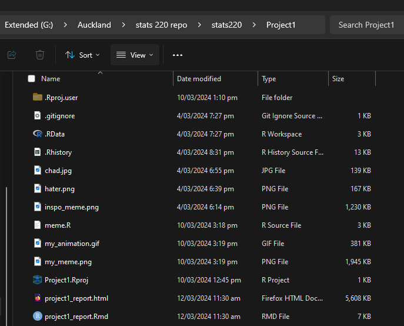

```{r setup, include=FALSE}
knitr::opts_chunk$set(echo=TRUE, message=FALSE, warning=FALSE, error=FALSE)
```

```{css}
@import url('https://fonts.googleapis.com/css2?family=Dancing+Script:wght@400;700&display=swap');

.title {
  color: #800080;
  background-clip: text;
  transition: color 0.3s ease;
}

.title:hover {
  text-shadow: 2px 2px 5px rgba(0, 0, 0, 0.3); /* add a shadow on hover */
}

.subtitle {
  font-family: 'Dancing Script', cursive;
  transition: color 0.3s ease, transform 0.5s ease; 
}

.subtitle:hover {
  color: #3366cc; /* change the color on hover */
}


p {
  font-size: 16px;
  line-height: 1.5;
  color: #333;
  background-color: #f2f2f2;
  padding: 10px;
  border-radius: 5px;
  margin-bottom: 15px;
  font-family: 'Roboto'
}

p:hover {
  background-color: #dcdcdc;
}

h2 {
  font-family: 'Montserrat'
  color: #333;
  border-bottom: 2px solid #800080; /* purple underline for headers */
  padding-bottom: 5px;
}

```

## Project requirements
I have used two different levels of headers, which are the title and then a
short explanation of the repo. These used the # and ## respectively. I then
used and un-ordered bullet point and then numbered (ordered) bullet points to 
show some additional info about what will be included in the repo. I used both
bold and italics in the text, I bolded the title and the 'Project Names' header
and put the 'Stats 220' in italics. I also provided two links, 1 to and image
and another to an external website, which is the project 1 info site.
This is the [link](https://github.com/bendwet/stats220) to my github repo.
Here is a screenshot of my project folder. NOTE: I did actually use the images
folder in my project, as seen in the screenshot, though I added the images
here just to show in the screenshot as well.



## My meme
Inspo image - I have decided to change the images and text, as well as the text font

```{r meme-code, eval=TRUE}
library(magick)

# image 1
average_hater <- image_read("hater.png") %>%
  image_scale(500)

# image 1 text
hater_text <- image_blank(width = 500, 
                          height = 50, 
                          color = "#FFFFFF",) %>%
  image_annotate(text = "Typical Stats 220 Hater",
                 color = "#000000",
                 size = 40,
                 font = "Arial",
                 gravity = "center") %>%
  image_charcoal()


# image 2
average_enjoyer <- image_read("chad.jpg") %>%
  image_scale(500)

# image 2 text
enjoyer_text <- image_blank(width = 500, 
                            height = 50, 
                            color = "#FFFFFF") %>%
  image_annotate(text = "Average Stats 220 Enjoyer",
                 color = "#000000",
                 size = 40,
                 font = "Arial",
                 gravity = "center") %>%
  image_charcoal()

# black bar
text_black_bar <- image_blank(width = 3,
                         height = 50,
                         color = "#000000")
image_black_bar <- image_blank(width = 3,
                              height = 500,
                              color = "#000000")

# make the columns

# text row
text_vector <- c(hater_text, text_black_bar, enjoyer_text)
top_row <- image_append(text_vector)

# images row
image_vector <- c(average_hater, image_black_bar, average_enjoyer)
bottom_row <- image_append(image_vector)

meme <- c(top_row, bottom_row) %>%
  image_append(stack = TRUE)

meme

```


```{r animation-code, eval=FALSE}
# Gif part

# numbers for the color squares text
counts <- 1: 3 %>% as.character()

green_square <- image_blank(color = 'green', width = 400, height = 400)
orange_square <- image_blank(color = 'orange', width = 300, height = 300)
red_square <- image_blank(color = 'red', width = 200, height = 200)

frame1 <- red_square %>%
  image_annotate(text = counts[3], size = 100, gravity = "center") %>%
  image_scale(200) %>%
  image_extent("500x500")

frame2 <- orange_square %>%
  image_annotate(text = counts[2], size = 100, gravity = "center") %>%
  image_scale(300) %>%
  image_extent("500x500")

frame3 <- green_square %>%
  image_annotate(text = counts[1], size = 100, gravity = "center") %>%
  image_scale(400) %>%
  image_extent("500x500")

frame4 <- meme %>%
  image_scale(500) %>%
  image_extent("500x500")

# frames vector
frames <- c(frame1, frame2, frame3)
morph_frames <- image_morph(c(frame3, frame4), frames=5)

all_frames = c(frames, morph_frames)


# create animation
animation <- image_animate(all_frames, fps = 2)


```

Here is my gif 

## Creativity
I used a lot of css to make the web page more stylish and fun looking. This
included some animation that I made, such as hover animations on the text
as well as the fonts. Another thing I added was the grey box borders around the
text to break it up for the white background, which makes it easier to see
where each area is. I also added the hover effect for aesthetic purposes as well
as the underlines on headers, to once again break up the different areas of the
text to make it clear where the specific area starts and previous one ends.
I also combined image morph and animate to make it so that final number count 
down in the gif morphs into my meme image instead of just showing the next frame
right away. I also added the charcoal function to the text, as I quite liked how
it gave it a sort of old pencil look, which was also a non required function
that I found in the magick library. This is more than the required task asked us to do, 
but I think it looks better this way. I also think I put a lot of effort into the 
explanations and explained more than the simple requirements.

## Learning reflection
I think an important idea I learned was how we can break something down into
smaller concepts then put all these pieces together to create the finished thing.
For example, the meme was broken down into text and images for the most part
then for the gif, adding frames. Then in terms of technical ideas, I would say
it would have to be learning R for the first time, as I already had some experience
with markdown and html/css, so learning a new language is always a great experience.
I am interested in exploring more how R can be used to manipulate and display data.
We have only seen the basic of what it can do, so it would be nice to see just
how far we can take R and what common use cases R is good for. It would be
interesting to see how R can be used to transform raw data into usable data
that we can then go onto plot of graphs, show on websites etc. 
